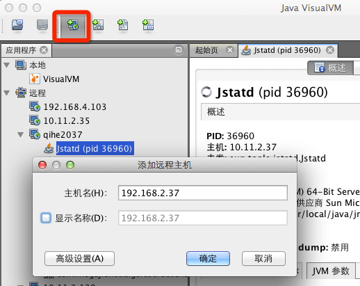
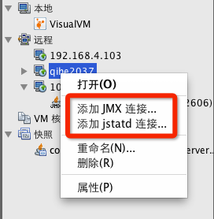

## 获取远程服务器上 Java 进程的运行状态

为了安全考虑, 有些服务器会被限制登录. 本文介绍如何获取远程服务器上 Java 进程的运行状态. 

### 启动 jstatd 服务

在服务器端启动 jstatd 服务后, 远程的机器可以通过 rmi 协议获取服务器上 Java 程序的运行状态.

在服务器上创建 jstatd 的授权文件, 假设文件路径为`/etc/jstatd.all.policy`, 内容如下:

```
grant codebase "file:/usr/local/java/lib/tools.jar" {
    permission java.security.AllPermission;
};
```

如果你的`JAVA_HOME`目录不是`/usr/local/java`的话, 请改为正确的值.

接下来通过以下命令启动 jstatd 服务:

	jstatd -J-Djava.security.policy=/etc/jstatd.all.policy -p 12345
	
需要注意的地方有:

* 授权文件的路径需要改成你自己的, 最好使用绝对路径.
* `-p`参数指定 jstatd 服务监听的端口. 如果不指定的话, 默认的端口为 1009. 不过从我自己的实践来看, 最好还是设定一个比1024大的端口号.

### 远程使用jps, jstat命令

在服务器上启动 jstatd 服务之后, 就可以在自己的机器上查看服务器上运行的 Java 进程了. 假设服务器的IP为 192.168.2.37, jstatd 服务监听的端口号为 12345.

首先通过 jps 命令获取服务器上运行的 Java 进程列表:

	jps -l rmi://192.168.2.37:12345

拿到 Java 进程的 pid 列表之后, 可以通过 jstat 命令获取某个进程的 GC 信息:

	jstat -gcutil rmi://39939@192.168.2.37:12345 1000 1000

其中 39939 表示 Java 进程的pid.

### 远程使用 VisualVM 监控 Java 应用

通过VisualVM, 可以在图形面板上看到很多 Java 应用的信息, 相当于多个命令(jps, jstat, jstack, jmap, jinfo)的集合.

VisualVM 是一个图形应用, 只能运行在本机, 然后通过远程连接, 获取服务器上的 Java 应用的信息.

通过 $JAVA_HOME/bin/jvisualvm 命令启动 VisualVM, 点击下图的红框部分, 输入要连接服务器的IP地址:



然后右键点击服务器地址, 可以看到能够通过2种方式连接服务器, 分别是 jmx 和 jstatd.



按照上述的步骤在服务器上启动 jstatd 服务后, 就能够以 jstatd 的形式连接到远程服务器了.

VisualVM 通过 jstatd 连接的方式能够获取的信息比较有限. 如果想获取更完整的 Java 应用信息, 可以通过 jmx 的方式连接服务器上的 Java 进程. 需要在启动 Java 应用的时候, 指定以下和 jmx 相关的参数:

```
-Djava.rmi.server.hostname=10.11.2.139 -Dcom.sun.management.jmxremote.authenticate=false -Dcom.sun.management.jmxremote.ssl=false -Dcom.sun.management.jmxremote.port=9090
```

`java.rmi.server.hostname`参数指定ip或者host, `com.sun.management.jmxremote.port`参数指定 jmx 监听的端口.

