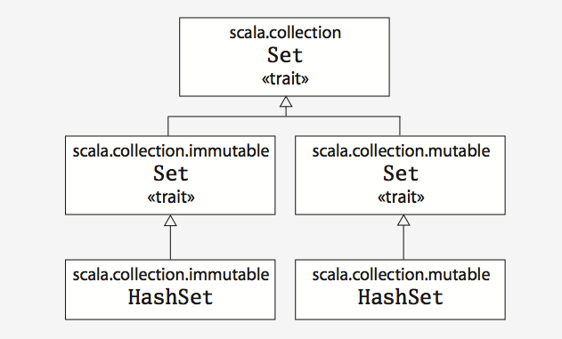

```
def max(x:Int, y:Int):Int = {
	if(x>y) x else y
}
```

Sometimes the Scala compiler will require you to specify the result type of a function. If the function is recursive, for example, you must explicitly specify the function's result type. In the case of `max` however, you may leave the result type off and the compiler will inter it. Also, if a function consists of just one statement, you can optionally leave off the curly braces.

```
def max(x:Int, y:Int) = if(x>y) x else y
```

Nevertheless, it is often a good idea to indicate function result types explicitly, even when the compiler doesnot require it. Such type annotations can make the code easier to read, because the reader need not study the function body to figure out the inferred result type.

----
Java's ++i and i++ donot work in Scala. To increment in Scala, you need to say either i=i+1 or i+=1.

----
One way to print each command line argument is:
	
	args.foreach(arg => println(arg))

In this code, you call the foreach method on args, and pass in a function. In this case, you are passing in a function literal that takes one parameter named `arg`. 

In the previous example, the Scala interpreter inters the type of `arg` to be String, since String is the element type of the array on which you are calling foreach. If you would prefer to be more explicit, you can mention the type name, but when you do you will need to wrap the argument portion in parentheses.

	args.foreach((arg: String) => println(arg))
	
If a function literal consists of one statement that takes a single argument, you need not explicitly name and specify the argument.
	
	args.foreach(println)
	
To summarize, the syntax for a function literal is a list of named parameters, in parentheses, a right arrow, and then the body of the function.

----
Another way to print each command line argument is:

	for(arg <- args) 
		println(arg)

To the right of the <- symbol is the familiar args array. To the left <- is "arg", the name of a val, not a var. (Because it is always a val, you just write "arg" by itself, not "val arg"). Although arg may seem to be a var, because it will get a new value on each iteration, it really is a val: arg cannot be reassigned inside the body of the for expression. Instead, for each element of the args array, a new arg val will be created and initialized to the element value, and the body of the for will be executed.

----
When you define a variable with val, the variable cannot be reassigned, but the object it refers could potentially still be changed.

	val greets = new Array[String](3)
	greets(0) = "Hello"
	greets(1) = ","
	greets(2) = "World!"
	
So in this case, you could not reassign greets to a different array, greets will always point to the same Array[String] instance with which it was initialized. But you can change the elements of the Array[String] over time, so the array itself is mutable.

----
If a method(not a function) takes only one parameter, you can call it without a dot or parentheses.

	0.to(2) // equals
	0 to 2
	
Note that this syntax only works if you explicitly specify the receiver of the method call. You can not write `println 10`, but you can write `Console println 10`.

---
Scala does not technically have operator overloading, because it does not actually have operators in the traditional sense. Instead, characters such as +,-,*,/ can be used in method names. Thus, when you typed `1+2`, you were actually `invoking a method named + on the Int object 1, passing in 2 as a parameter`. You could alternatively have written `1+2` using traditional method invocation syntax `(1).+(2)`.

----
In Scala, you can access an element by specifying an index in parentheses. So the first element in Scala array named args is args(0), not args[0], as in Java.

In Scala, when you apply parentheses surrouding one or more values to a variable, Scala will transform the code into an invocation of a method named `apply` on that variable. So `greets(0)` gets transformed into `greets.apply(0)`. Thus accessing an element of an array in Scala is simply a method call like any other.

This principle is not restricted to arrays: any application of an object to some arguments in parentheses will be transformed to an `apply` method call. Of course this will compile only if that type of object actually defines an `apply` method. So it is not a special case; it is a general rule.

Similarly, when an assignment is made to a variable to which parentheses and one or more arguments have been applied, the compiler will transform that into an invocation of an `update` method that takes that arguments in parentheses as well as the object to the right of equals sign. For example, `greets(0) = "hello"` will be transformed into: `greets.update(0, "hello")`.

----
As you have seen, a Scala array is a mutable sequence of objects that all share the same type. An Array[String] contains only strings, although you can not change the length of an array after it is instantiated, you can change its element values. Thus, arrays are mutable objects. 

For an immutable sequence of objects that share the same type you can use scala.List class. As with arrays, a List[String] contains only strings.

	val numbers = List(1, 2, 3) // List.apply(1, 2, 3)
	
You can use `::` operator to prepends a new element to the beginning of an existing list, and returns the resulting list.

	val numbers = List(2, 3)
	val oneTwoThree = 1::numbers // oneTwoThree = List(1, 2, 3)
	
You can also use `:::` for list concatenation:

	val numbers = List(1, 2) ::: List(3, 4) // List(1, 2, 3, 4)
	
Note that in the expression `1::numbers`, `::` is a method of its right operand, the `numbers`. There is a simple rule to remember: If a method is used in operator notation, such as `a*b`, the method is invoked on the left operand, unless the method name ends in a colon. If the method name ends in a colon, the method is invoked on the right operand. Therefore, in `1::numbers` the `::` method is invoked on `numbers`, passing `1`.

Given that a shorthand way to specify an empty list is Nil, one way to initialize new lists is to string together elements with the `::` operator, with Nil as the last element.

	val numbers = 1::2::3::Nil // List(1, 2, 3)

----
Like lists, tuples are immutable, but unlike lists, tuples can contain different types of elements.

	var pair = (99, "Hello")
	println(pair._1)
	println(pair._2)
	
To instantiate a new tuple that holds some objects, just place the objects in parentheses, separated by commons. Once you have a tuple instantiated, you can access its elements individually with a dot, underscore, and the `one-based` index of the element.

The actual type of a tuple depends on the number of elements it contains and the types of those elements. Thus, the type of (99,"jell") is Tuple2[Int,String]; The type of ('u', 'r', "the", 1, 4, "me") is Tuple6[Char, Char, String, Int, Int, String].

---
Scala API contains a base trait for sets, and also provides two subtraits, one for mutable sets and another for immutable sets. These three traits all share the same simple name, Set. There full qualified names differ, however, because each resides in a different package.

Concrete set classes in the Scala API, such as HashSet classes extend either the mutable or immutable Set trait. Thus, if you want to use a HashSet, you can choose between mutable and immutable varieties depending upon your needs.



	var jetSet = Set("Boeing", "Airbus")
	jetSet += "Lear"
	println(jetSet.contains("Cessna"))
	
To add a new element to a set, you call `+` on the set, passing in the new element. Both mutable and immutable sets offer a `+` method, but their behavior differs. Whereas a mutable set will add the element to itself, an immutable set will create and return a new set with the element added.

---
As with sets, Scala provides mutable and immutable versions of Map, using a class hierarchy.

	import scala.collection.mutable.Map
	
	val treasureMap = Map[Int, String]()
	treasureMap += (1->"Go to island")
	treasureMap += (2->"Find big x on ground")
	treasureMap += (3->"Dig")
	println(treasureMap(2))
	
This `->` method, witch you can invoke on any object in a Scala program, returns a two-element tuple containing the key and value.

	val romanMap = Map(
		1->"I", 2->"II", 3->"III"
	)
	
	
----
In Scala, `public` is the default access level.

Method parameters in Scala are vals, not vars.

---
Prefer vals, immutable objects, and methods without side effects. Reach for them first. Use vars, mutable objects, and moethods with side effects when you have a specific need and justification for them.

---


